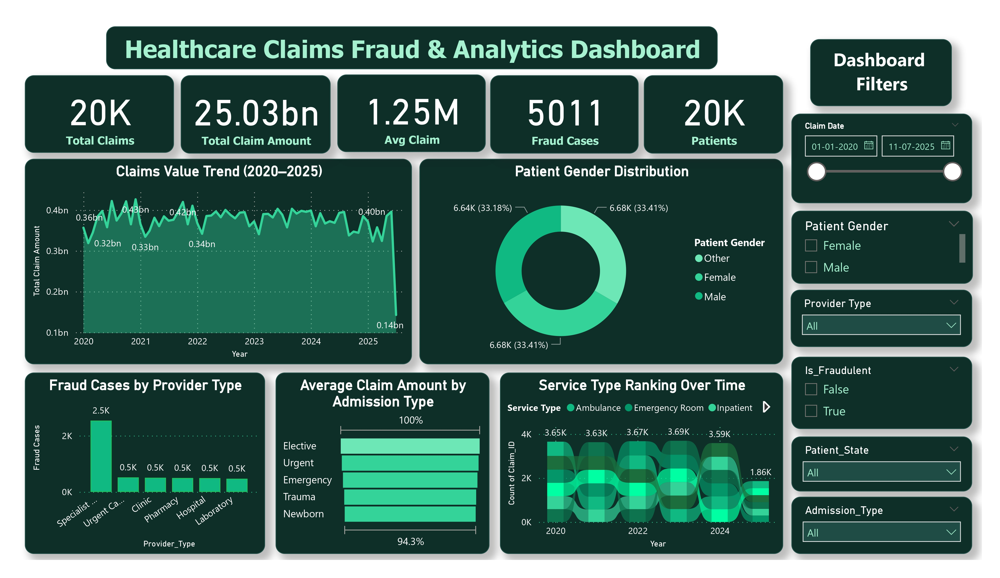

# Healthcare Claims Fraud Analytics Dashboard

An end-to-end healthcare claims analytics project demonstrating data preprocessing, exploratory data analysis, and interactive business intelligence using **Python** and **Power BI**.

This project analyzes healthcare insurance claims to uncover fraud patterns, provider performance, claim trends, reimbursement insights, and operational KPIs through an interactive dashboard.

---

## Dashboard Preview

<p align="center">

</p>

---

## 📌 Project Overview

Healthcare insurance organizations process thousands of claims every day. Identifying fraudulent claims, monitoring reimbursement trends, and understanding provider performance are essential for improving operational efficiency.

This project performs:

- Data preprocessing and cleaning using Python
- Exploratory Data Analysis (EDA)
- Feature engineering
- Interactive Power BI dashboard development
- Healthcare claims analytics
- Fraud monitoring through KPI visualization

---

## 📁 Repository Structure

```
Healthcare-Claims-Fraud-Analytics
│
├── analysis
│   ├── 01_data_preprocessing.ipynb
│   └── 02_exploratory_data_analysis.ipynb
│
├── dataset
│   ├── claim_data.csv
│   ├── health_claims_cleaned.csv
│   └── data_dictionary.md
│
├── Healthcare Dashboard.pbix
├── dashboard_preview.jpg
├── README.md
├── requirements.txt
└── .gitignore
```

---

# Dataset

The dataset contains healthcare insurance claims submitted by providers.

Each record contains information regarding

- Claim ID
- Provider ID
- Patient ID
- Date of Service
- Procedure Code
- Diagnosis Code
- Charge Amount
- Paid Amount
- Insurance Type
- Claim Status
- Reason Code
- Follow-up Required
- Accounts Receivable Status
- Claim Outcome

The complete description of every feature is available in **dataset/data_dictionary.md**

---

# Data Preprocessing

Python was used for cleaning and preparing the dataset before visualization.

The preprocessing pipeline includes:

- Loading raw healthcare claims data
- Missing value inspection
- Duplicate detection
- Data type conversion
- Date parsing
- Feature engineering
  - Year
  - Month
  - Quarter
  - Claim Difference
- Exporting cleaned dataset for dashboard development

---

# Exploratory Data Analysis

The exploratory analysis includes

- Dataset overview
- Summary statistics
- Missing value analysis
- Claim status distribution
- Insurance distribution
- Provider-wise claim analysis
- Diagnosis-wise analysis
- Monthly claim trends
- Interactive visualizations using Plotly

---

# Power BI Dashboard

The interactive dashboard provides

## Executive KPIs

- Total Claims
- Total Claim Amount
- Average Claim Amount
- Fraud Cases
- Total Patients

## Interactive Visualizations

- Claims trend over time
- Patient gender distribution
- Fraud cases by provider type
- Admission type analysis
- Service type trends
- Dynamic filters
- Provider analysis
- Patient analysis

---

# Technologies Used

### Programming

- Python

### Libraries

- Pandas
- NumPy
- Matplotlib
- Plotly

### Business Intelligence

- Power BI
- DAX

### Tools

- VS Code
- Jupyter Notebook

---

# Business Insights

The dashboard helps answer questions such as

- How do healthcare claims vary over time?
- Which providers generate the highest fraud cases?
- Which insurance types have the highest claim volumes?
- How much reimbursement is paid compared to billed amounts?
- Which admission types contribute to higher claim amounts?
- How do patient demographics influence claim trends?

---

# Learning Outcomes

Through this project, I gained practical experience in

- Data preprocessing
- Exploratory Data Analysis (EDA)
- Feature engineering
- Data visualization
- Business Intelligence
- Dashboard development
- Healthcare claims analytics
- KPI design
- Interactive reporting

---

# Future Improvements

- Predictive fraud detection using Machine Learning
- Claim approval prediction
- Automated anomaly detection
- SQL database integration
- Real-time dashboard updates
- Cloud deployment

---

# Author

**Yamuna Latchipatruni**

B.Tech Computer Science (Data Science)

VNR Vignana Jyothi Institute of Engineering and Technology

---

⭐ If you found this project useful, consider giving it a star.
